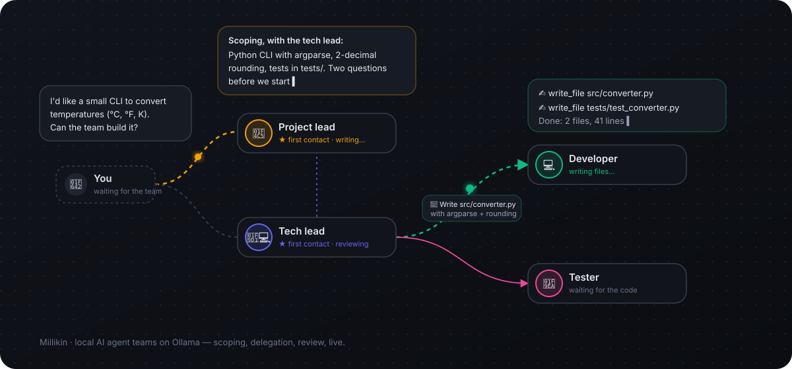

<div align="center">

# Millikin

**Your AI team, running on your machine.**

Millikin is a local-first workspace where teams of AI agents scope your idea, ask the right questions,
split the work, build it and review each other — entirely on [Ollama](https://ollama.com), with no cloud and no API bill.


[**Website**](https://karma91430.github.io/Millikin/) · [Features](#features) · [Get started](#get-started) · [How it works](#how-a-project-runs) · [Architecture](#architecture)



</div>

> The interface is in French 🇫🇷 — the code, docs and this README are in English.

## Why Millikin

Cloud agent platforms are powerful but costly, and they see all your data. Local models are free and private,
but on their own they struggle with long, multi-step work. Millikin wraps them in the structure a real team uses —
roles, a first point of contact, scoping before execution, delegation, review, a board and sprints — and shows you
every exchange live.

Think of it as **LiteLLM and an agent workspace fused together**, with a Kanban board and a visual view of who is talking to whom.

## Features

| | |
|---|---|
| 🕸️ **Visual team builder** | Drag agents onto a canvas, draw “can delegate to” links, mark one or more **first points of contact** (★). |
| 🧭 **Scoping before delegation** | First contacts **consult each other**, restate your need and ask questions. Nothing is delegated until you click **Validate & launch**. |
| 💬 **Live agent graph** | Bubbles fill in as agents write; links light up during delegations; **expand** any agent’s answer while it is still streaming. |
| 🗂️ **Projects** | Created from a team template (the team is copied and stays editable), each with its **own folder**, board, conversations and stats. |
| ▶️ **Tasks that run themselves** | Launch a card: the assignee does the work, a first contact **reviews** it (verdict, score, comment) and the status updates automatically. |
| ⛓️ **Dependencies & chains** | Tasks depend on others; their results and a shared **decision log** flow to the next agent. Run a whole chain in dependency order. |
| 🏃 **Planning & sprints** | One click: the project lead, with the tech lead, breaks the project into **estimated tasks** (story points, priority, assignee) grouped into **sprints**. |
| 👤 **Agent profiles** | 34 ready-made profiles in 7 categories, each with the tools its role needs; your own profiles; AI-generated agents or whole teams. |
| 📚 **RAG, skills, MCP** | Local embeddings over your docs (txt, md, pdf, code), reusable Markdown skills, and any **MCP** server (stdio or HTTP). |
| 🏷️ **Knowledge graph** | Documents tagged by the **local model** (one theme + specific tags), shown as constellations; an animated search lab shows hybrid search and reranking step by step. |
| 🧩 **Skill library** | 22 built-in skills (code review, debugging, user stories, ML evaluation, executive summary…), filterable by category and assignable to agents in one click. |
| 🖥️ **Machine advisor** | Detects your hardware (RAM, Apple Silicon / NVIDIA GPU, disk), tells which Ollama models fit smoothly for each use, installs them and measures their real speed. |
| 🌍 **French / English** | One switch for the whole interface; agents then answer in the chosen language. |
| 🛠️ **Agent tools** | Web search (self-hosted SearXNG), page reading, sandboxed file read/write per project, optional shell commands, board management. |
| ⏳ **Background runs** | Local answers take minutes: runs keep going when you switch screens or reload, with an “answer ready” notification. |
| 📊 **Gateway & stats** | Ollama console (installed / loaded / pull), usage per agent and per project, and an **OpenAI-compatible proxy** for your other tools. |

## How a project runs

```
You            → Project lead ★
Project lead   ↔ Tech lead ★        consultation between first contacts
Project lead   → You                approach + questions            (scoping)
You            ✅ Validate & launch                                  (execution)
Tech lead      → Developer          "write src/converter.py"
Tech lead      → Tester             "write tests/test_converter.py"
Tech lead      ↩ Developer          "fix the rounding"               (review loop)
Project lead   → You                report · decisions logged in docs/DECISIONS.md
```

## Get started

**Requirements:** Node.js 22+ and Ollama with a model that supports tools (e.g. `qwen3:8b`) and an embedding model (e.g. `nomic-embed-text`).

```bash
ollama pull qwen3:8b
ollama pull nomic-embed-text

git clone https://github.com/Karma91430/Millikin.git
cd Millikin
npm install
npm run dev        # → http://127.0.0.1:3210
```

On first launch Millikin creates `data/millikin.db`, detects your installed Ollama models and adds a demo team template.
Then: **Projets → Nouveau projet** from a team template, and start talking to it in the workspace.

**Optional — web search:** agents with the web search tool query a [SearXNG](https://docs.searxng.org/) instance
(default `http://127.0.0.1:8888`, with the JSON format enabled). Change the URL in **Réglages**.

### Model tips

- An **8B model with tool support** (e.g. `qwen3:8b`) is a good baseline on a 16–18 GB machine; a full team cycle takes minutes.
- Give each agent **the tools its role needs, and no more**: built-in profiles come with a sensible kit, and **Réglages → Diagnostic** tells you which tools can run on your machine.
- Turn **thinking** on for leads (better orchestration) and off for specialists (faster). Runaway reasoning is capped automatically.
- For better reviews, give first contacts a larger model — on this machine or another Ollama host on your network.

## Agent tools

| Tool | Notes |
|---|---|
| `ask_agent` | Delegation along the team links, given automatically. |
| `web_search` | SearXNG search, with an optional DuckDuckGo fallback when SearXNG is unreachable. |
| `fetch_url` | Reads a URL: readable text from HTML, pretty JSON, plain text or PDF (size-capped). |
| `http_request` | Calls an API (GET/POST/PUT/PATCH/DELETE, headers, JSON body). Disabled during task reviews. |
| `list_files`, `read_file`, `write_file`, `edit_file` | Confined to the project folder (paths escaping it, symlinks included, are refused). |
| `run_command` | Shell in the project folder (or a sub-folder) with a timeout. Opt-in per agent. |
| `board_list`, `board_add_card`, `board_update_card` | Kanban board, with dependencies and story points. |
| `record_decision` | First contacts log decisions in `docs/DECISIONS.md`, which every project agent receives. |
| `search_knowledge` | RAG search; the best passages are also injected automatically. |
| MCP tools | Every attached server adds its tools as `<server>__<tool>`. |

## OpenAI-compatible proxy

`http://127.0.0.1:3210/api/v1` exposes `/chat/completions`, `/embeddings` and `/models`. Use `ollama/qwen3:8b` as the model
name. An optional key can be set in **Réglages**. Every call is logged under **Modèles → Utilisation**.

## Architecture

| Path | Role |
|---|---|
| `src/lib/gateway.ts` | Native Ollama calls (`/api/chat`, `/api/embed`): context size, thinking, reasoning cap, usage logging. |
| `src/lib/orchestrator.ts` | Agent loop and tools, team-graph delegation, consultation of first contacts, scoping/execution phases. |
| `src/lib/runs.ts` | Server-side run registry: runs survive page changes; clients re-attach with a snapshot. |
| `src/lib/taskrun.ts`, `planner.ts` | Board task runs with review, dependency chains, project planning into sprints. |
| `src/lib/tools.ts`, `mcp.ts`, `rag.ts` | Built-in tools, MCP client, chunking + embeddings + cosine search. |
| `src/lib/team.ts`, `trace.ts` | Team graph model; shared run-trace format (one node per agent call). |
| `src/components/` | React UI; the live graph and the team builder use React Flow. |
| `docs/` | This project’s website (GitHub Pages). |

Data lives in SQLite (`node:sqlite`, no native dependency) under `data/`; project files under `workspace/` or any folder you choose.
Both are git-ignored.

## Security notes

- The server listens on **127.0.0.1 only**: stdio MCP servers and `run_command` execute local commands with your user.
- Provider keys and MCP headers are stored in plain text in the local SQLite database.
- File tools cannot leave the project folder; `run_command` is opt-in per agent.

## Contributing

Work happens on `features/<name>` branches, merged into `main`. Issues, ideas and forks are welcome.

## License

[MIT](LICENSE) © 2026 Arthur Delerue — you can use, modify and fork Millikin freely, as long as you keep the copyright and license notice.
